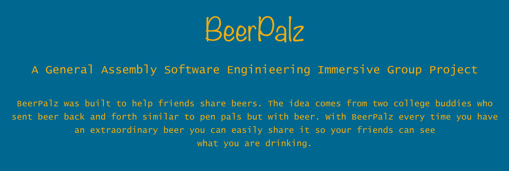

# BeerPalz 
### A General Assembly Software Enginieering Immersive Group Project

BeerPalz was built to help friend share beers. The idea comes from two college buddies who sent beer back and forth like a pen pals but with beer. Using beer pals everytime you have an extrodinary beer you can easily share it on BeerPalz so your friends can see what your drinking.

### Brief Example
Below is the initial wireframe for this project:

 
### Features 
This app features full CRUD capability:
Users can view the most recent posts from other users on the Home page
Users can view individual posts by clicking on their titles
Users can view individual profiles by clicking on the post, then the user
Users can post new songs via a "new post" page
Users can edit or delete any of their posts
Users can search Spotify's database to grab a song link and listen to a preview
 
#### Technologies Used
This app was built using Express, Mongoose, React, Node.js.

*React.js

*Express
Utilized express to handle requests from users, sava data to SoundDump's database, and process the data
Implemented HTTP methods using both Express and JavaScript

*Mongoose
Used mongoose to create schemas to make it easier to interact with MongoDB within SoundDump
Created post and user models to organize data

*Node.js

##3 Unsolved Problems / Future Directions

I would like to have the ability to search for a song directly in the "new post" page
I would like to make it easier for a user to post a song without the embedded link.

##Building a Development Env
### Getting Started

To create a development enviorment start by forking and cloning this repository. 

### Prerequisites

react
express
mongoose

```
Give examples
```

Code to run in terminal

```
Give the example
```

And repeat

```
until finished
```

End with an example of getting some data out of the system or using it for a little demo


## Deployment

BeerPalz is deployed at .....

## Built With

React
Express 
Mongoose
Node.js

## Contributing

For contributions please submit a pull request to  


## Authors & Contributors

**Taylor Penberthy** 
**JonPaul Ferzacca** 
**Anthony Bui** 
**Shaym Maharaj** 
